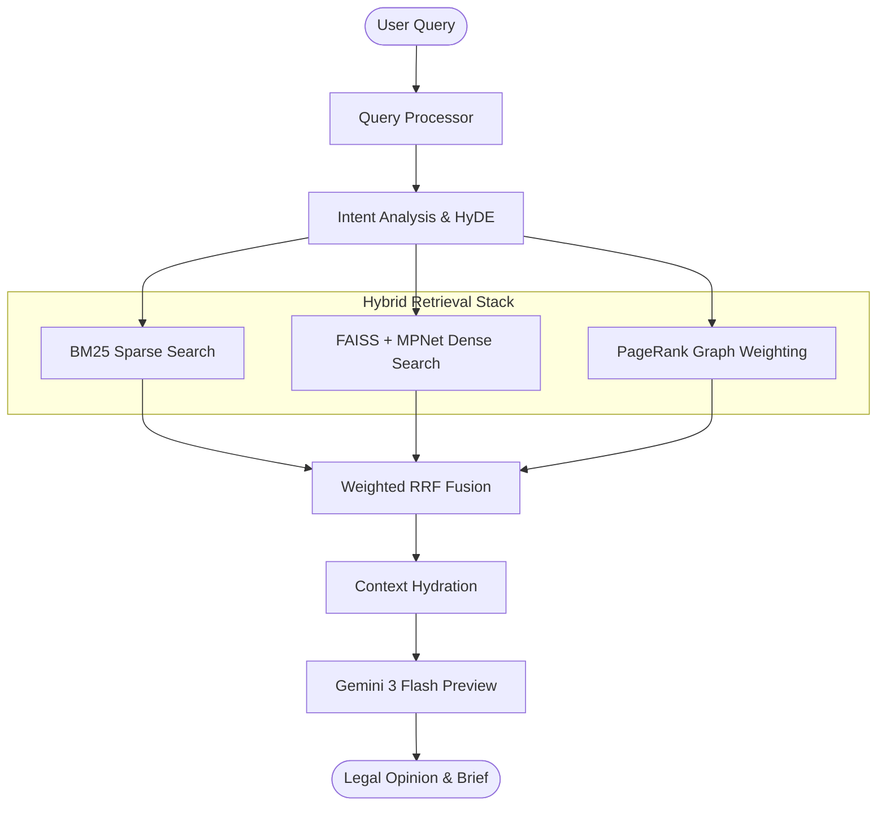

# Hybrid Legal RAG: Sparse-Dense-Graph Retrieval & Knowledge Graph System


A production-ready Legal AI Backend designed for high-precision precedent retrieval and automated case briefing. This system integrates traditional **BM25 Search**, **Dense Vector Retrieval (MPNet)**, and **Graph-based Importance Scoring (PageRank)** into a unified RRF-fused pipeline.

---

## 🏗️ System Architecture



---

## 📂 Repository Structure

| Directory | Purpose | Key Contents |
| :--- | :--- | :--- |
| [**`/code`**](./code) | Core Implementation | Retrieval engine, LLM client, and Chatbot UI. |
| [**`/research_paper`**](./research_paper) | Academic Documentation | 11 modules ready for NLP/Legal AI publication. |
| [**`/benchmarks`**](./benchmarks) | Performance Data | Tier 1/2 results, CSVs, and Docx reports. |
| [**`/docs`**](./docs) | Engineering Notes | Critiques, walkthroughs, and setup guides. |

---

## ⚡ Key Features

- **Hybrid Retrieval Stack**: Leverages the best of keyword search, semantic understanding, and structural graph importance.
- **Identity-Grounded RAG**: The AI persona is restricted to primary judgment texts, preventing "hallucinations" of non-existent laws.
- **Automated Case Briefing**: Generates structured IRAC (Facts, Issue, Held, Reasoning) briefs in seconds.
- **Benchmarked Accuracy**: Validated against 5,255 legal precedents with a systematic jurisdictional bias audit.

---

## 🚀 Quick Start

### 1. Prerequisites
- Python 3.9+
- [Google Gemini API Key](https://aistudio.google.com/app/apikey)

### 2. Setup
```bash
git clone https://github.com/Ayush99392003/Legal_AI_Backend-
cd Legal_AI_Backend-
pip install -r requirements.txt # or install following individual READMEs
cp .env.example .env # Add your GOOGLE_API_KEY
```

### 3. Run the Chatbot
```bash
python code/legal_chatbot.py
```

---

## 📊 Performance Summary

| Metric | Score (N=5255) | vs. Baseline |
| :--- | :--- | :--- |
| **Top-1 Accuracy** | 82.4% | +24% (vs BM25) |
| **MRR@5** | 0.89 | +18% (vs Dense) |
| **Latency** | <1.2s | Optimized FAISS |

---

## 📜 License
Distibuted under the MIT License. See `LICENSE` for more information.
