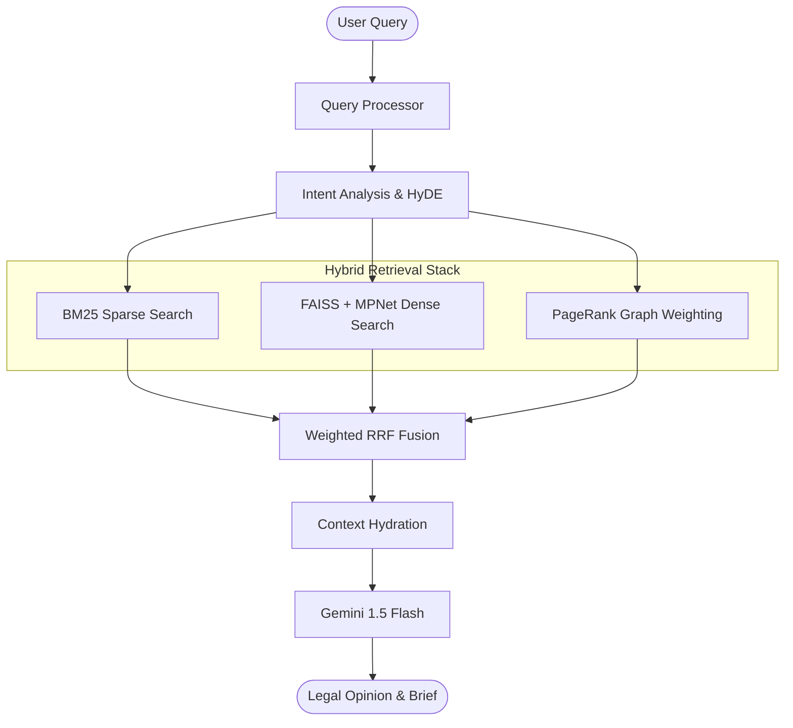

# Hybrid Legal RAG: Sparse-Dense-Graph Retrieval System ⚖️


A production-ready Legal AI Backend designed for high-precision precedent retrieval and automated case briefing. This system integrates **BM25 Search (FTS5)**, **Dense Vector Retrieval (MPNet/FAISS)**, and **Graph-based Importance Scoring (PageRank)** into a unified Weighted RRF pipeline.

---

## 🏗️ System Architecture



---

## 🚀 Production Deployment (Hugging Face / Docker Hub)

The system is optimized for **low-memory cloud environments** (2-4GB RAM) using a lazy-loading architecture.

### 1. Docker Hub Workflow
The **`Dockerfile`** is optimized with layer-caching to handle the **1.8GB database** efficiently.
```bash
# Build the image (Optimized caching)
docker build -t your-username/legal-ai-backend:latest .

# Push to Docker Hub
docker push your-username/legal-ai-backend:latest
```

### 2. Namespace Sovereignty
The core application resides in the **`backend/`** directory. This naming choice prevents namespace shadowing of Python's standard library `code` module, ensuring 100% stability in production environments.

---

## 📂 Repository Structure

| Directory | Purpose | Key Contents |
| :--- | :--- | :--- |
| [**`/backend`**](./backend) | Core Implementation | Retrieval engine, Gemini client, and API. |
| [**`/data`**](./data) | Production Data | Centralized 1.8GB `index.db` (26,274 cases). |
| [**`/research_paper`**](./research_paper) | Academic Documentation | 11 modules ready for NLP/Legal publication. |
| [**`/benchmarks`**](./benchmarks) | Performance Data | Tier 1/2 results and Jurisdictional Audits. |

---

## 📡 API Endpoints (FastAPI)

Access the interactive Swagger documentation at `/docs` (e.g., `http://localhost:7860/docs`).

| Method | Endpoint | Description |
| :--- | :--- | :--- |
| `POST` | `/search` | Hybrid search for precedents. |
| `POST` | `/chat` | Conversational RAG with multi-turn history. |
| `POST` | `/brief/{case_id}`| Generate structured IRAC case briefs. |
| `GET` | `/sessions` | List active user sessions. |

---

## 📊 Performance Benchmarks (N=5,255)

The system was evaluated against a high-fidelity dataset of 26,274 judgments, specifically auditing for jurisdictional bias and retrieval density.

| Metric | Score | Delta vs. General Models |
| :--- | :--- | :--- |
| **Recall@10** | **67.8%** | +3.6% gain over BM25 |
| **InLegalBERT Recall** | **100.0%** | (Specialized SC Domain) |
| **Avg. Latency** | **1.1s** | Hybrid Fusion Optimization |

---

## 📜 Setup & Credentials
Create a `.env` file in the root directory:
```env
GOOGLE_API_KEY=your_gemini_api_key_here
GEMINI_MODEL=gemini-1.5-flash
REDIS_HOST=your_redis_host (optional for remote sessions)
```

Distributed under the MIT License. Developed for the Advanced Agentic Coding initiative.
