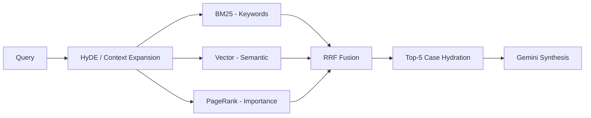

# 💻 Source Code Implementation

This directory contains the core Python modules for the Legal AI Retrieval and Chatbot system.

## 🛠️ Module Architecture

| Module | Responsibility | Engine Type |
| :--- | :--- | :--- |
| `search_engine.py` | Hybrid Search Orchestrator | RRF-Fusion |
| `llm_client.py` | Google Gemini 3 Flash Interface | LLM / Synthesis |
| `vector_store.py` | FAISS Indexing & Retrieval | Dense (MPNet) |
| `storage_manager.py` | SQLite Case Persistence | Database |
| `rag_pipeline.py` | One-shot RAG Pipeline | Contextual Generation |
| `legal_chatbot.py` | Interactive CLI Chatbot | UI / Loop |

---

## 🔁 Hybrid Retrieval Flow



---

## 🚀 Key Implementation Details

### 1. Hybrid Search (RRF)
We use **Reciprocal Rank Fusion (RRF)** to combine Sparse, Dense, and Graph results. This ensures that a case is ranked highly only if it appears reasonably high across multiple retrieval modalities.
- **Sparse (BM25)**: Handles exact keyword matching (e.g., specific law sections).
- **Dense (MPNet)**: Captures semantic similarity (e.g., similar factual situations).
- **Graph (PageRank)**: Weights cases by their citation influence.

### 2. Gemini 3 Flash Preview
The `LLMClient` uses the new `google-genai` SDK. It features:
- **Streaming Response support**: (WIP)
- **Token Metadata tracking**: Monitors usage in real-time.
- **JSON Mode**: Enforces structured outputs for categorization and entity extraction.

---

## 🧪 Running Tests
To verify the LLM integration, run:
```bash
python code/test_gemini_connection.py
```
To run a RAG demo:
```bash
python code/rag_pipeline.py "Precedents for child custody rights of father in India"
```
