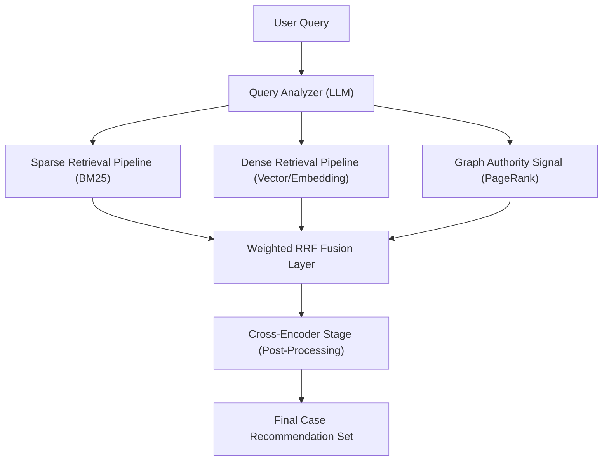

# 3. Methodology Overview

## 3.1 The Integrated Retrieval Pipeline
The core of our proposed system is a three-tiered architecture that processes each query through parallel retrieval pipelines. This ensures that both lexical (exact word) and latent (semantic concept) relevance are captured simultaneously.

### High-Level Architecture

## 3.2 Component Breakdown
The architecture consists of four primary modules:
1. **Query Analyzer**: An LLM-based agent that extracts legal keywords, identifies potential categories, and assesses query complexity.
2. **Retrieval Pipelines**:
    - **Sparse (Lexical)**: Optimizes for known identifiers and exact phrasing using an optimized BM25 implementation.
    - **Dense (Semantic)**: Optimizes for conceptual similarity using deep transformer embeddings.
    - **Graph (Structural)**: Uses PageRank as an authority signal to quantify document importance.
3. **Fusion Layer**: Implements a weighted Reciprocal Rank Fusion to merge results into a unified ranking.
4. **Post-Processing**: (Optional) Re-ranking stage for high-precision validation.

## 3.3 Dynamic Strategy Selection
A key innovation of this methodology is the **Dynamic Weighting** mechanism. The system identifies whether a query is a "Citation-Based Search" (short, keyword-heavy) or a "Scenario-Based Search" (long, descriptive). 

For **Scenario-Based Search**, the system automatically triples the weight of the Dense signal, as semantic intent is the primary driver of relevance in such contexts.
