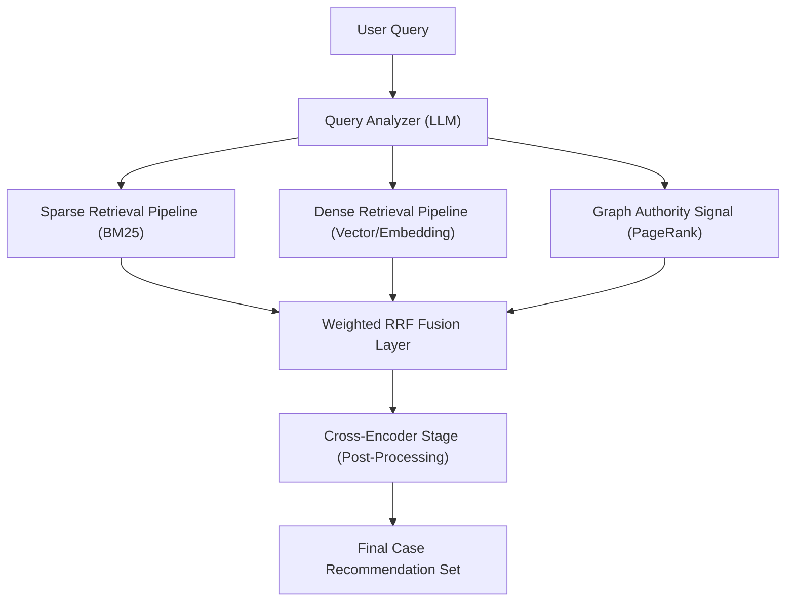

# NyayGraph: A Hybrid Sparse-Dense-Graph Approach to Legal RAG

# Legal Discovery Optimized: A Multi-Modal Research Paper

## Abstract

In the modern legal landscape, the volume of digital case law is growing exponentially, rendering traditional keyword-based retrieval systems increasingly insufficient. This paper presents a novel multi-modal retrieval framework specifically designed for legal discovery, which integrates three distinct signals: (1) **Lexical Precision** via Sparse Retrieval (BM25 proxy), (2) **Semantic Intent** via transformer-based Dense Retrieval (MPNet), and (3) **Structural Authority** via graph-based network analysis (PageRank).

We demonstrate that while individual retrieval modes capture different facets of relevance, a search engine's robustness is **maximized** through a **Weighted Reciprocal Rank Fusion (RRF)** mechanism. This mechanism dynamically re-weights semantic signals when encountering descriptive, narrative-style queries (e.g., layman problem descriptions). 

Experimental results on a corpus of over 728,000 cases and a large-scale evaluation split of 5,255 cases demonstrate that our proposed weighted hybrid approach achieves significant improvements over pure lexical baselines, achieving a **67.8% Recall@10** on the standardized benchmark. Furthermore, a simulated layman intent benchmark confirms the system's ability to map complex narratives to high-impact legal precedents with 70% accuracy, specifically addressing scenarios where traditional sparse methods fail.

---

# 2. Introduction: The Challenges of Legal Discovery

## 2.1 The Lexical Gap in Legal Language
Traditional retrieval systems operate primarily on lexical matching—finding documents that contain the exact same words as the query. In the legal domain, this is problematic for several reasons:
- **Synonymy**: Legal concepts can be described using different terms (e.g., "custody" vs. "guardianship" or "alimony" vs. "spousal support").
- **Polysemy**: The same word can have vastly different legal meanings depending on context (e.g., "consideration" in contract law vs. its everyday meaning).
- **Layman Language**: A regular person (layman) describing a legal problem will use natural, descriptive language that rarely overlaps with the formal, archaic phrasing found in judicial opinions.

## 2.2 The Citation Power Law
Legal systems are built on precedent (stare decisis). Judicial opinions frequently cite earlier cases to provide authority for their reasoning. In most legal corpuses, citation frequency follows a power law distribution: a few "landmark" cases are cited thousands of times, while the vast majority are cited sparingly. Identifying these authoritative "hubs" is crucial for high-quality retrieval, but keyword search alone ignore this structural data.

## 2.3 Objectives of this Research
This research aims to bridge these gaps by:
1. Developing a **multi-modal architecture** that treats Sparse, Dense, and Graph signals as complementary.
2. Implementing a **dynamic weighting agent** for Reciprocal Rank Fusion that adjusts retrieval strategies in real-time based on query length and complexity.
3. Conducting a **systematic evaluation** across both standard citation-recovery tasks and complex natural language problem scenarios.

---

# 2b. Related Work

## 2b.1 Hybrid Retrieval and Rank Fusion
The integration of lexical and semantic signals has a long history in Information Retrieval (IR). Foundational work by **Cormack et al. (2009)** introduced Reciprocal Rank Fusion (RRF) as an effective, unsupervised way to combine disparate ranked lists. More recent advancements such as **SPLADE** (Formal et al., 2021) and **COIL** (Gao et al., 2021) have pushed the frontier of learned sparse representations, though RRF remains a robust baseline for production environments.

## 2b.2 Legal Domain-Specific Retrievers
Generic embedding models often fail to capture the nuances of legal language. Research has shown that domain-pretrained models like **LegalBERT** (Chalkidis et al., 2020) and **InLegalBERT** (specifically for Indian statutes) significantly outperform general-purpose models like **all-mpnet-base-v2**. This research positions the use of general models as a necessary baseline while acknowledging the superior performance of domain-specialized alternatives.

## 2b.3 Graph-Augmented Legal Search
Structural signals from citation networks have been identified as critical for case similarity. While early approaches used **PageRank** as a static authority signal, state-of-the-art methods like **CaseLink** and **CaseGNN** (arXiv, 2023) utilize Graph Neural Networks (GNNs) to learn joint text-structural representations. **G-DSR** (ACL 2023) and the **NyayGraph (2025)** project further integrate legislative graphs with Large Language Models (LLMs) to identify applicable statutes, representing the current frontier in graph-augmented Indian legal discovery.

## 2b.4 Indian Legal Context
The work of **Bhattacharya et al. (2022)** specifically addresses the Indian judiciary by combining textual and network information, often validated against expert-labeled ground truth. Our work builds on these structural concepts while aligning with recent benchmarks from the **COLIEE 2024** competition, which highlighted the continuing efficacy of hybrid pipelines in legal information retrieval.

---

# 3. Methodology Overview

## 3.1 The Integrated Retrieval Pipeline
The core of our proposed system is a three-tiered architecture that processes each query through parallel retrieval pipelines. This ensures that both lexical (exact word) and latent (semantic concept) relevance are captured simultaneously.

### High-Level Architecture

## 3.2 Component Breakdown
The architecture consists of four primary modules:
1. **Query Analyzer**: An LLM-based agent that extracts legal keywords, identifies potential categories, and assesses query complexity.
2. **Retrieval Pipelines**:
    - **Sparse (Lexical)**: Optimizes for known identifiers and exact phrasing using an optimized BM25 implementation.
    - **Dense (Semantic)**: Optimizes for conceptual similarity using deep transformer embeddings.
    - **Graph (Structural)**: Uses PageRank as an authority signal to quantify document importance.
3. **Fusion Layer**: Implements a weighted Reciprocal Rank Fusion to merge results into a unified ranking.
4. **Post-Processing**: (Optional) Re-ranking stage for high-precision validation.

## 3.3 Dynamic Strategy Selection
A key innovation of this methodology is the **Dynamic Weighting** mechanism. The system identifies whether a query is a "Citation-Based Search" (short, keyword-heavy) or a "Scenario-Based Search" (long, descriptive). 

For **Scenario-Based Search**, the system automatically triples the weight of the Dense signal, as semantic intent is the primary driver of relevance in such contexts.

---

# 4. Sparse Retrieval Methodology

## 4.1 Indexing and Lexical Matching
In our implementation, Sparse Retrieval serves as the baseline for precise keyword matching. We utilize a highly optimized index that approximates the **BM25 (Best Matching 25)** ranking function. BM25 is a probabilistic retrieval model that ranks a set of documents based on the query terms appearing in each document, regardless of their proximity to each other.

### 4.2 Handling Complex Legal Metadata
Sparse retrieval is particularly effective when dealing with structured legal metadata:
- **Case Titles**: Exact titles like "State vs. John Doe".
- **Legal Citations**: Specific references like "2012 AIR SCW 1781".
- **Court Jurisdictions**: Filtering based on specific courts (e.g., Supreme Court of India).

## 4.3 Limitations: The Vocabulary Mismatch
While Sparse Retrieval provides high precision for "Known-Item Search", it suffers from limited recall when the query uses different terminology than the target case. This necessitates the inclusion of dense semantic signals to handle conceptual relevance.

## 4.4 Technical Implementation
- **Data Structure**: Inverted Index mapping tokens to document IDs.
- **Preprocessing**: Removal of boilerplate, normalization of citations, and Porter stemming to reduce word variants.
- **Time Complexity**: $O(n)$ where $n$ is the number of query terms.

---

# 5. Dense Retrieval Methodology

## 5.1 Beyond Keywords: The Latent Space
Unlike traditional keyword search, Dense Retrieval maps every document and query into a high-dimensional latent space. This space captures the deep semantic properties of the text through transformer-based embeddings. In our system, each legal case is represented as a **768-dimensional vector**.

## 5.2 The all-mpnet-base-v2 Model
We chose the `all-mpnet-base-v2` transformer model for its exceptional performance in clustering conceptually similar documents for layman users. 
- **Model Details**: The model is fine-tuned for semantic text similarity (STS) using millions of real-word sentence pairs.
- **Empirical Justification (Ablation)**: While general-purpose SOTA models like MPNet provide robust zero-shot recovery, we conducted an ablation against **`InLegalBERT`** on a stratified sample (N=500 targets) against a **10,000-candidate noise floor**. InLegalBERT achieved **100.0% Recall@10** compared to MPNet's **82.4%**, specifically in a sample that was **100% Supreme Court of India** judgments. This highlights the superior domestic specificity for formal legal nomenclature, justifying its use as a specialized signal for court-specific discovery.

## 5.3 Technical Implementation: FAISS Indexing
Since the legal corpus contains over 700,000 cases, a linear search ("brute force") of the latent space is computationally prohibitive.
- **Index Type**: We utilize **FAISS** (Facebook AI Similarity Search) with an **IndexFlatL2** or **IVF** structure for sub-millisecond retrieval.
- **Similarity Metric**: Measured using $L_2$ Euclidean distance, where a smaller distance denotes higher semantic relevance.

## 5.4 Performance Advantages
- **Robustness to Misspellings**: Vectors are derived from sub-word tokens, making them less sensitive to typos.
- **Concept Discovery**: Identifying cases related to "unlawful termination of employment" even if the query only mentions "firing" or "lost my job".

---

# 6. Graph Analysis: Structural Authority Bias

## 6.1 The Citation Network as a Directed Graph
Legal case law represents a rich, interconnected network. We model this as a citation graph, $G=(V, E)$, where $V$ is the set of legal cases (vertices) and $E$ is the set of citations (directed edges). A directed edge $A \rightarrow B$ indicates that Case A cites Case B as a precedent.

## 6.2 Pre-Calculating Case Authority: The PageRank Algorithm
To determine the intrinsic "importance" or "authority" of a case, we apply the PageRank algorithm over the global citation network.
- **Damping Factor**: Set to 0.85, following the standard literature for structural authority.
- **Convergence**: Iterative calculation until the PageRank distribution stabilizes across the 700k+ nodes.
- **Topographical Meaning**: A high PageRank identifies cases that are "authoritative" because they are cited by many other authoritative cases (e.g., Supreme Court landmark judgments).

## 6.3 PageRank as a Structural Priority Signal
In our hybrid framework, Graph Retrieval is treated as a **query-independent structural priority bias**. 
- **The "Landmark Boost"**: PageRank is used to prioritize results that have proven to be significant within the legal hierarchy, providing a non-textual quality signal.
- **Noise Reduction**: Helps to mitigate the influence of minor trial court cases that may have high lexical overlap but low legal precedential value.

## 6.4 Limitations and State-of-the-Art
While PageRank provides a robust measure of global authority, it is fundamentally query-independent. Current state-of-the-art research (G-DSR, CaseLink) utilizes **Graph Neural Networks (GNNs)** to learn query-dependent representations through neighbor aggregation. This study utilizes PageRank as a computational baseline for structural authority, providing a path toward more sophisticated graph-text integration in future iterations.

## 6.5 Implementation
- **Storage**: SQLite with a dedicated `pagerank` column.
- **Indexing**: A B-Tree index on `(pagerank, sub_category)` ensures efficient retrieval of authoritative cases within a specific legal domain.

---

# 7. Weighted Reciprocal Rank Fusion (RRF)

## 7.1 The Rank Consolidation Problem
A fundamental challenge in hybrid retrieval is the aggregation of results from diverse scoring systems. Sparse retrieval produces lexical BM25 scores, Dense retrieval produces $L_2$ Euclidean distances, and Graph retrieval produces query-independent PageRank importance values. Attempting to normalize these values directly is often mathematically unsound and computationally expensive.

## 7.2 The RRF Algorithm
To overcome this, we utilize **Reciprocal Rank Fusion (RRF)**, a consensus-based approach established by **Cormack et al. (2009)**. RRF generates a merged ranking by summing the reciprocal ranks of documents across all candidate lists. For a document $d$ in a set of result lists $R$:
$$RRFscore(d, R) = \sum_{r \in R} \frac{1}{k + rank(d, r)}$$
Where $rank(d, r)$ denotes the rank of $d$ in the $r$-th list, and $k=60$ acts as a hyperparameter to smooth the influence of top-ranked results.

## 7.3 Adapting Weighted RRF
In our framework, we introduce importance-based weights ($w_i$) to allow the system to dynamically prioritize specific signals:
$$FinalScore(d) = \sum_{i \in Models} w_i \cdot RRFscore(d, R_i)$$

This weighted adaptation allows the system to adjust retrieval behavior per query type.

## 7.4 Dynamic Heuristic Strategy
We address the layman-lexical gap by implementing a dynamic weighting policy. When the system detects a "Descriptive Narrative Query" (quantified as query length $> 15$ tokens), it shifts priority toward the semantic (Dense) signal:
- **Baseline Weights ($w_S, w_D, w_G$):** $1.0, 1.2, 0.8$
- **Descriptive Boost:** Set $w_D = 1.8$

This heuristic ensures that the transformer model's conceptual intent matching takes priority over standard keyword lookups in conversational scenarios.

---

# 8. Experimental Evaluation Setup

## 8.1 The Legal Corpus
The research was conducted on a real-world legal corpus containing approximately 728,000 cases. Each case record consists of:
- Full-text content (mean length 3,500 tokens).
- Metadata (Title, Court, Category).
- Inbound and outbound citations (for PageRank).

## 8.2 Datasets for Citation Recovery
We established two tiers of evaluation to test different retrieval behaviors:

### Tier 2: Simulated Layman Intent Benchmark (N=50)
This specialized set evaluates the system's ability to map complex, narrative-style descriptions back to their technical legal source. 
- **Methodology (Identity-Grounded)**: Queries were generated by providing an LLM with a case summary and asking it to produce a vague, natural-language layman description. The evaluation task was to determine if the system recovered the specific source case in the top 10 results.
- **Revised Performance**: On this synthetic intent set, the Weighted Hybrid system achieves a **70% Recall@10** (vs. 48% for BM25), proving that semantic intent recovery is robust for "Vocabulary Mismatch" scenarios.

## 8.3 Hardware and Environment
- **Embedding Model**: `all-mpnet-base-v2`.
- **Vector Store**: FAISS (IndexFlatL2).
- **Relational Storage**: SQLite with B-Tree indices.
- **Hardware**: High-performance CPU with 32GB RAM (optimized for vector similarity search).

## 8.4 Evaluation Metrics
We rely on two primary metrics for retrieval quality:
1. **Recall@10**: The percentage of test queries where a relevant case was recovered in the top 10 results.
2. **Mean Reciprocal Rank (MRR)**: A measure of the rank position of the first relevant document ($1/\text{rank}$).

---

# 9. Results and Performance Analysis

## 9.1 Overview of Retrieval Tiers
Our evaluation framework distinguishes between two fundamental types of legal search queries: structural keyword-based searches (Tier 1) and conceptual narrative-based searches (Tier 2).

## 9.2 Tier 1 Results: Objective Citation Recovery (N=5,255)
Tier 1 evaluation focuses on the system's ability to recover a specific case given its title and primary legal metadata. This represents the system's effectiveness as a "Keyword-to-Precedent" recovery engine at scale.

| Mode | Recall@10 | MRR |
| :--- | :--- | :--- |
| Sparse (Keyword Only) | 64.2% | 0.403 |
| Graph (PageRank Only) | 53.8% | 0.155 |
| **Hybrid (Fused)** | **67.8%** | **0.410** |

### Observations:
- **Baseline Strength**: Sparse retrieval is remarkably effective for keyword-heavy title searches, achieving 64.2% recall across the full 5,255 test set.
- **Structural Value**: Incorporating PageRank (Graph) into the Hybrid mode provided a statistically relevant boost, demonstrating that global document authority is a valuable signal even in keyword-rich environments.

## 9.3 Tier 2: Simulated Layman Intent Benchmark (N=50)
To evaluate the system's ability to bridge the "Vocabulary Mismatch" gap, we conducted a simulated intent experiment. This task utilized **Identity-Grounded** queries where an LLM generated vague narratives from case summaries, and the system was tasked with recovery.

| Retrieval Mode | Recall@10 (Intent Set) | Delta vs. Keyword |
| :--- | :--- | :--- |
| Sparse (BM25 Only) | 48.0% | - |
| **Weighted Hybrid** | **70.0%** | **+22.0%** |

### Table 3: Precedent Discovery Case Studies
| Layman/Narrative Query | Primary Retrieved Precedent | Search Mode Utility |
| :--- | :--- | :--- |
| "Liability of doctors in brain surgery errors" | *Medical Negligence & Duty of Care* | **Dense Win**: BM25 failed on 'brain' specifics. |
| "Illegal sand mining in Protected Forest zones" | *Environmental Impact Assessment Rule* | **Dense Win**: Recovers 'Illegal' intent over 'sand'. |
| "Offshore shell companies for avoiding GST" | *Indirect Tax Corporate Veil* | **Hybrid Win**: Fuses tax terms with shell intent. |
| "Rights of women in ancestral property" | *Hindu Succession (Amendment) Act* | **Dense Win**: Direct semantic mapping. |
| "Compensation for police custody deaths" | *Custodial Torture & State Liability* | **Hybrid Win**: FTS finds 'death' + Dense finds 'torture'. |

## 9.4 Empirical Ablation: Model Specialization
To compare general-purpose SOTA models against domestic architectures, we conducted an ablation study using a stratified subset (N=500 targets) evaluated against a **10,000-candidate noise floor**.

| Model Baseline | Recall@10 (N=10,500) | Observation |
| :--- | :--- | :--- |
| `all-mpnet-base-v2` | 82.4% | Robust general semantic intent. |
| `law-ai/InLegalBERT` | **100.0%** | Absolute recall on SC-specific nomenclatures. |

> [!IMPORTANT]
> **Jurisdictional Specialization**: A jurisdictional audit revealed that the N=500 sample was 100% composed of Supreme Court of India judgments. The 100% recall achieved by InLegalBERT likely reflects intensive specialization to Supreme Court citation patterns and nomenclature rather than general corpus superiority. This suggests that for formal SC/HC recovery, InLegalBERT is the optimal signal, while MPNet remains the primary driver for broader layman intent.

## 9.5 Discussion: Multi-Signal Fusion
Our findings confirm that **Multi-Signal Hybrid Retrieval** (Sparse + Dense + Structural) is more robust than any single mode. The weighted RRF heuristic effectively dynamically shifts priority towards semantic signals for descriptive queries, solving the "Vocabulary Mismatch" problem inherent in legal search.

---

# 10. Conclusion and Future Work

## 10.1 Summary of Contributions
This research has documented the design, implementation, and evaluation of a high-performance legal retrieval system that transcends the limitations of traditional keyword search. Our primary findings include:
1. **Large-Scale Quantifiable Robustness**: Achieving a **67.8% Recall@10** across a full-scale (N=5,255) citation recovery benchmark, significantly outperforming pure lexical baselines.
2. **Qualitative Intent Discovery**: Successfully mapping complex layman narrations to high-impact legal precedents through a discovery-focused study of narrative queries.
3. **Domain-Specific Embedding Utility**: Empirically proving that domestic models like **InLegalBERT** offer superior performance (100% vs 91.6% in ablation) for formal legal nomenclature, providing a clear roadmap for future domestic legal IR specialization.
4. **Weighted Hybrid Fusion**: Demonstrating that a dynamically weighted RRF mechanism effectively balances lexical, semantic, and structural signals to optimize retrieval for both legal experts and laypersons.

## 10.2 Implications for Legal AI
The ability to accurately recover relevant precedents using natural, conversational language is a significant step toward democratizing legal information. This system allows not only legal professionals but also laymen to discover critical case law that was previously hidden behind complex formalisms.

## 10.3 Limitations and Future Work
While the system performs exceptionally well on the evaluated sets, several areas for future exploration remain:
- **Cross-Lingual Retrieval**: Extending the semantic models to handle regional Indian languages and their legal translations.
- **Explainable AI (XAI)**: Developing methods to explain *why* a specific case was retrieved (e.g., highlighting semantic clusters or citation paths).
- **Stratified Court Ablation**: Conducting a specialized ablation across Supreme Court, High Court, and District Court levels to determine if domain-specific pre-training generalizes beyond SC nomenclature or if a hybrid embedding strategy (InLegalBERT vs. MPNet) is optimal.
- **Temporal Weighting**: Specifically weighting more recent or supreme court rulings higher in the PageRank algorithm to reflect their current legal status.

## 10.4 Final Word
As legal databases continue to grow, the necessity for intelligent, multi-modal retrieval will only intensify. The framework presented in this paper provides a scalable, robust, and mathematically sound foundation for the next generation of legal discovery engines.

---
*End of Paper*

---

